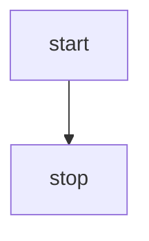

# VNFnet - Design Requirements

# 1. How does VNFnet work currently?
the current simulator has a couple of classes:
- Service -> Service Level Agreement
- Host -> hosts services, uses resources
- User -> traffic pattern, has chain of VMs
- Link -> source/destination and connection characteristics
- VM -> has Host, also Service? groups VNFs on host
- Chain -> Has SLA and list of VMs
- Domain -> collection of hosts and links
- Connection -> path of nodes and User object, node path vs. chain?
- Network -> used to interact with the network as a whole, I guess this could be seen as the simulation 'engine'.

I think this python file is supposed to be used as a library in other programs. 


# 2. How should VNFnet work after the project?
- simplify substrate network and add abstractions
- generate traffic
- report environment state and update according to commands -> ==formulate commands==
- visualize the network -> grave?
- optionally support VNFs being shared by multiple SFCs
- ==find factors to simulate resource usage==
- ==how do we know what edges are used in the chain?==
- static vs. mobile vs. dynamic?
- use networkX to generate substrate network

## Substrate
- ```nodes```: hash map of ```Node``` class
- ```edges```: hash map of ```Edge``` class
- ```insert_vm(target_node: host_id, virtual_machine: VM)```:  decrease resources of ```Node``` with ```host_id``` and update available resources of nodes and edges and return node_id, or error if no resources are available
- ```remove_vm(target_node: Node, virtual_machine: VM)```: update available resources of nodes and edges
### Host class (node)
- ```uid```: index in ```nodes```  hash table
- ```cpu_avail``` available cpu resources according to topology
- ```memory_avail``` available memory resources according to topology
- ```storage_avail``` available storage according to topology
### Link class (edge)
- ```uid```: index in ```edges``` hash table
- ```avail_bandwidth```: available bandwidth according to topology
- ```latency```: latency of the connection according to topology

## Simulation
- ```virtual_machines```: hash map of ```VirtualMachine``` classes
- ```chains```: hash map of ```ServiceChain``` class
- ```allocate_function(target_vm: vm_id, function: NetworkFunction) -> function_id```: add ```function``` to ```functions``` of ```target_vm``` and return ```function_id``` or error if no resources available
- ```free_function(target_vm: vm_id, function_id: uid)```: remove function with ```function_id``` from ```functions``` of ```target_vm```
- ```allocate_chain(chain: ServiceChain)```: allocate all the VNFs on all the VMs and add ```chain``` to ```chains``` or fail because of resource constraints
### VirtualMachine
- ```uid```: index in ```virtual_machines``` hash map
- ```host_id```: index of ```Host``` in ```Substrate``` hash map
- ```functions```: hash map of managed ```NetworkFunction``` objects
- ```cpu_base```: base cpu utilization of virtual machine
- ```memory_base```: base memory utilization of virtual machine
- ```storage_base```: base storage utilization of virtual machine
- ```bandwidth_base```: base bandwidth utilization of virtual machine
### ServiceChain
- ```functions```: list of ```NetworkFunction``` classes that make up the chain
- ```lifetime```: duration that the chain should be active, after which it will be deallocated
- ```calculate_latency()```: calculate the total latency of a chain
#### NetworkFunction class
- ```uid```: index in ```functions``` hash map
- ```vm_id```: index of parent ```VirtualMachine``` in ```virtual_machines``` hash map
- ```lifetime```: duration that VNF should be active, inherited from parent ```ServiceChain```
- ```cpu_usage```: function of traffic
- ```memory_usage```: function of traffic
- ```storage_usage```: function of traffic
- ```processing_time```: time it takes to process request

## Environment
- combination of ```Substrate``` and ```Simulation```
- ==do we want to support penalties for over-utilization of resources?==
- generate requests of the form: (ServiceChain, Environment) -> use information on from ```Substrate``` and ```Simulation```

#### Environment
- ```network```: ```Substrate``` object
- ```simulation```: ```Simulation``` object
- ```create_topology()```: create and return a representation of a ```network``` and ```simulation```: class with topology according to model or configuration
- ```get_current_state()```: return representation of the current state of the ```network``` and  ```simulation```
- ```reset()```: reset simulation and return reset state
- ```step()```: decrease the ```lifetime``` attribute of all ```ServiceChain``` objects
- ```embed_sfc(chain: ServiceChain)```: embed a ```ServiceChain``` object on the network 
- ```create_vm()```:
- ```remove_vm()```:
- ```migrate_vm()```:

- ```generate_service_request() -> ServiceChain```: generate a random unembedded chain of unembedded VNFs, see [[what is traffic generation]].

## Monitor
- stores and visualizes current Environment state?

## RemoteAgentInterface
- asynchronous messaging between remote agent and Environment

# Dependency Graph
[mermaid tutorial](https://mermaid.js.org/intro/)


## How should it work?
- VNFnet seems to be used as a library, so we should maybe keep it a python library
- Cyril wrote "Roughly speaking, the environment should be able to report its state to the implementation and apply the returned embedding policy on-the-fly".
- by making the modules communicate in the form of protobufs, we make the framework easily extendable
- scheduling -> we could do discrete time, but real networks don't do that.

Illustration in SFCsim paper: ![[Pasted image 20240413001256.png]]
SFCsim schefuling: ![[Pasted image 20240416133522.png]]
from Tom Wassings paper: ![[Pasted image 20240416115237.png]]

![[Pasted image 20240417114519.png]]

# 3. How to do service graph embedding
- place VNF from SFC on SN randomly?

4. propose network traffic generation strategy
