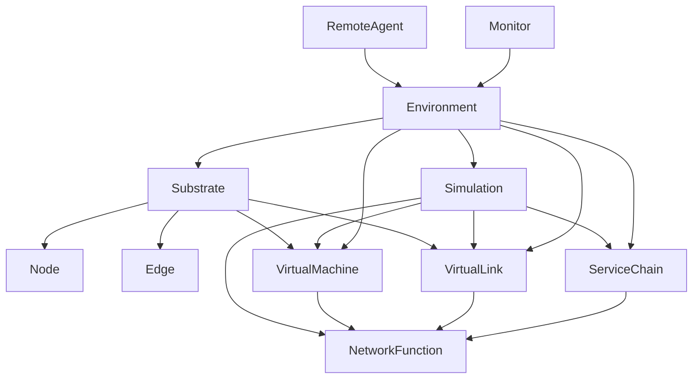

# VNFnet - Design Requirements

# 1. How does VNFnet work currently?
the current simulator has a couple of classes:
- Service -> Service Level Agreement
- Host -> hosts services, uses resources
- User -> traffic pattern, has chain of VMs
- Link -> source/destination and connection characteristics
- VM -> has Host, also Service? groups VNFs on host
- Chain -> Has SLA and list of VMs
- Domain -> collection of hosts and links
- Connection -> path of nodes and User object, node path vs. chain?
- Network -> used to interact with the network as a whole, I guess this could be seen as the simulation 'engine'.

I think this python file is supposed to be used as a library in other programs. 


# 2. How should VNFnet work after the project?
- optionally support VNFs being shared by multiple SFCs
- ==find factors to simulate resource usage==
- static vs. mobile vs. dynamic?
- ==do we want to support penalties for over-utilization of resources?==
- ==how do we combine synchronous time steps with asynchronous message passing?==
	- let the remote agent do as many sfc generations/embeddings as it wants in between time steps

### Device
An enum containing (PCI-e) devices. This could be extended to also include resource allocation on these devices.
### Host (node)
- ```Int uid```: index in ```nodes```  hash table
- ```[Device] devices_avail``` list of available devices on the host
- ```Float cpu_avail``` available CPU resources according to topology
- ```Float memory_avail``` available memory resources according to topology
- ```Float storage_avail``` available storage according to topology
### Link (edge)
- ```Int uid```: index in ```edges``` hash table
- ```Float bandwidth_avail```: available bandwidth according to topology
- ```Float latency```: latency of the connection according to topology
- ```Float transfer_rate```: percentage of traffic that gets successfully delivered
### NetworkFunction
- ```Int uid```: index in ```functions``` hash map
- ```Int vm_id```: index of parent ```VirtualMachine``` in ```virtual_machines``` hash map
- ```Int vl_id```: index of ```VirtualLink``` in ```virtual_links``` hash map
- ```cpu_usage```: function of traffic
- ```memory_usage```: function of traffic
- ```storage_usage```: function of traffic
- ```Float processing_time```: time it takes to process request
## VirtualMachine
- ```Int uid```: index in ```virtual_machines``` hash map
- ```Int host_id```: index of ```Host``` in ```Substrate``` hash map
- ```HashMap<NetworkFunction> functions```
- ```[Devices] devices``` list of available devices on the machine
- ```cpu_base```: base cpu utilization of virtual machine
- ```memory_base```: base memory utilization of virtual machine
- ```storage_base```: base storage utilization of virtual machine
### VirtualLink
- ```Int uid```: index in the ```virtual_links``` hash map
- ```NetworkFunction source```: link source
- ```NetworkFunction destination```: link destination
- ```Float bandwidth```: bandwidth used by the link
- ```Float latency```: inherited from physical link
## Substrate
contains the state of the simulated substrate network
- ```HashMap<Node> nodes```
- ```HashMap<Edge> edges```

- ```insert_vm(target_node: host_id, virtual_machine: VirtualMachine) -> Ok() | Err()```:  decrease available resources of ```Node``` with ```host_id```, or fail if no resources are available.
- ```remove_vm(target_node: Node, virtual_machine: VirtualMachine) -> void```: increase available resources of ```Node``` with ```host_id```.
- ```insert_vl(target_edge: edge_id, virtual_link: VirtualLink) -> Ok() | Err()```: decrease available resources of ```Edge``` with ```edge_id```, or fail if no resources are available.
- ```remove_vl(target_edge: edge_id, virtual_link: VirtualLink) -> void```: increase available resources of ```Edge``` with ```edge_id```.

	**ideas**
	- as the network gets bigger, keeping the nodes and edges in memory will cause significant slowdown. We could implement a database to keep track of more data, possibly even in a distributed way.
	- we can use this state to visualize the network in a possible GUI

### ServiceChain
- ```List<NetworkFunction> functions```: list of *unembedded*```NetworkFunction``` classes that make up the chain
- ```Int lifetime```: duration that the chain should be active, after which it will be de-allocated
- ```calculate_latency() -> Float```: calculate the total latency of a chain

# Simulation
Contains the state of the entire simulation
set up /  created using [[Resource Description Framework]]

- ```HashMap<VirtualMachine> virtual_machines```
- ```HashMap<VirtualLink> virtual_links```
- ```HashMap<ServiceChain> chains```
- ```allocate_function(target_vm: vm_id, function: NetworkFunction) -> function_id```: add ```function``` to ```functions``` of ```target_vm``` and return ```function_id``` or error if no resources available
- ```free_function(target_vm: vm_id, function_id: uid) -> void```: remove function with ```function_id``` from ```functions``` of ```target_vm```
- ```allocate_chain(chain: ServiceChain) -> Ok() | Err()```: allocate all the VNFs on all the VMs and add ```chain``` to ```chains``` or fail because of resource constraints

# TrafficGenerator
Generates service requests in the form of ```ServiceChain``` objects. These service requests will consist of random(?) NetworkFunctions in a specific order. The frequency of requests will be following a [[Poisson distribution]]. There are two possibilities of implementation:

1. Push - We open a pub/sub pipe and send requests in 'real-time' according to the distribution.
2. Pull - We expose a function that, when called, returns an amount of service requests according to the distribution

	**Ideas**
	- I guess this class doesn't even need to know about the current state of the substrate network.

# Environment
This will be the class that the remote agent interacts with, it combines the state of the network trough the ```Simulation``` class and generates service requests trough the ```Traffic generator``` object. It should be very simple, since Anestis will add functionality later on.

It should have a pub/sub interface to relay the generated service requests from the ```TrafficGenerator``` object.


### Ideas
- if we define a ```Resources``` class, we could use instances of that class everywhere. would make adding resources later easier


# Dependency Graph
[mermaid tutorial](https://mermaid.js.org/intro/)


## How should it work?
- VNFnet seems to be used as a library, so we should maybe keep it a python library
- Cyril wrote "Roughly speaking, the environment should be able to report its state to the implementation and apply the returned embedding policy on-the-fly".
- by making the modules communicate in the form of protobufs, we make the framework easily extendable
- use networkX to generate substrate network

Illustration in SFCsim paper: ![[Pasted image 20240413001256.png]]
SFCsim schefuling: ![[Pasted image 20240416133522.png]]


# 3. How to do service graph embedding
- place VNF from SFC on SN randomly?

>Cyril:  "agent will propose (predict) an embedding assignment and the env will decide if the assignment is valid, if yes then execute (accept) otherwise reject."

# 4. propose network traffic generation strategy

result  -> compare rust + python
DEVICES Interface -> hosts have devices, can be used by vm
network generation -> look at java code

# TODO:
Mermaid sequence diagram