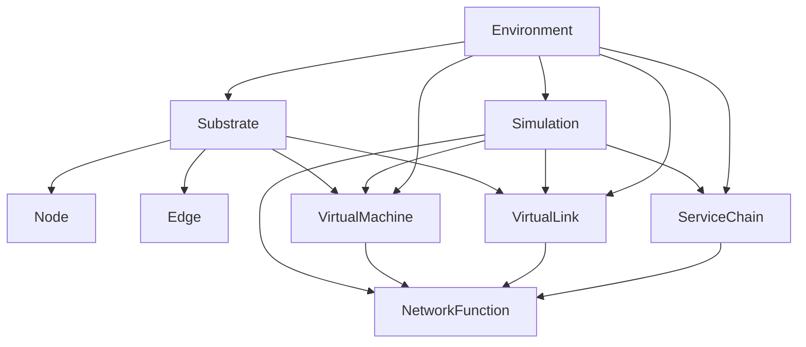

# VNFnet - Design Requirements

# 1. How does VNFnet work currently?
the current simulator has a couple of classes:
- Service -> Service Level Agreement
- Host -> hosts services, uses resources
- User -> traffic pattern, has chain of VMs
- Link -> source/destination and connection characteristics
- VM -> has Host, also Service? groups VNFs on host
- Chain -> Has SLA and list of VMs
- Domain -> collection of hosts and links
- Connection -> path of nodes and User object, node path vs. chain?
- Network -> used to interact with the network as a whole, I guess this could be seen as the simulation 'engine'.

I think this python file is supposed to be used as a library in other programs. 


# 2. How should VNFnet work after the project?
- optionally support VNFs being shared by multiple SFCs
- ==find factors to simulate resource usage==
- static vs. mobile vs. dynamic?
- ==do we want to support penalties for over-utilization of resources?==
- ==how do we combine synchronous time steps with asynchronous message passing?==
	- let the remote agent do as many sfc generations/embeddings as it wants in between time steps

## Substrate
- ```HashMap<Node> nodes```
- ```HashMap<Edge> edges```
- ```insert_vm(target_node: host_id, virtual_machine: VirtualMachine) -> Ok() | Err()```:  decrease available resources of ```Node``` with ```host_id```, or fail if no resources are available.
- ```remove_vm(target_node: Node, virtual_machine: VirtualMachine) -> void```: increase available resources of ```Node``` with ```host_id```.
- ```insert_vl(target_edge: edge_id, virtual_link: VirtualLink) -> Ok() | Err()```: decrease available resources of ```Edge``` with ```edge_id```, or fail if no resources are available.
- ```remove_vl(target_edge: edge_id, virtual_link: VirtualLink) -> void```: increase available resources of ```Edge``` with ```edge_id```.
### Host class (node)
- ```Int uid```: index in ```nodes```  hash table
- ```Float cpu_avail``` available CPU resources according to topology
- ```Float memory_avail``` available memory resources according to topology
- ```Float storage_avail``` available storage according to topology
### Link class (edge)
- ```Int uid```: index in ```edges``` hash table
- ```Float avail_bandwidth```: available bandwidth according to topology
- ```Float latency```: latency of the connection according to topology
- ```Float transfer_rate```: percentage of traffic that gets successfully delivered

## Simulation
- ```HashMap<VirtualMachine> virtual_machines```
- ```HashMap<VirtualLink> virtual_links```
- ```HashMap<ServiceChain> chains```
- ```allocate_function(target_vm: vm_id, function: NetworkFunction) -> function_id```: add ```function``` to ```functions``` of ```target_vm``` and return ```function_id``` or error if no resources available
- ```free_function(target_vm: vm_id, function_id: uid) -> void```: remove function with ```function_id``` from ```functions``` of ```target_vm```
- ```allocate_chain(chain: ServiceChain) -> Ok() | Err()```: allocate all the VNFs on all the VMs and add ```chain``` to ```chains``` or fail because of resource constraints
### VirtualMachine
- ```Int uid```: index in ```virtual_machines``` hash map
- ```Int host_id```: index of ```Host``` in ```Substrate``` hash map
- ```HashMap<NetworkFunction> functions```
- ```cpu_base```: base cpu utilization of virtual machine
- ```memory_base```: base memory utilization of virtual machine
- ```storage_base```: base storage utilization of virtual machine
### VirtualLink
- ```Int uid```: index in the ```virtual_links``` hash map
- ```NetworkFunction source```: link source
- ```NetworkFunction destination```: link destination
- ```Float bandwidth```: bandwidth used by the link
### ServiceChain
- ```List<NetworkFunction> functions```: list of *unembedded*```NetworkFunction``` classes that make up the chain
- ```Int lifetime```: duration that the chain should be active, after which it will be deallocated
- ```calculate_latency() -> Float```: calculate the total latency of a chain
#### NetworkFunction
- ```Int uid```: index in ```functions``` hash map
- ```Int vm_id```: index of parent ```VirtualMachine``` in ```virtual_machines``` hash map
- ```Int vl_id```: index of ```VirtualLink``` in ```virtual_links``` hash map
- ```Int lifetime```: duration that VNF should be active, inherited from parent ```ServiceChain```
- ```cpu_usage```: function of traffic
- ```memory_usage```: function of traffic
- ```storage_usage```: function of traffic
- ```Float processing_time```: time it takes to process request

## Environment
- ```network```: ```Substrate``` object
- ```simulation```: ```Simulation``` object
- ```create_topology()```: create and return a representation of a ```network``` and ```simulation```: class with topology according to model or configuration
- ```get_current_state()```: return representation of the current state of the ```network``` and  ```simulation```
- ```reset()```: reset simulation and return reset state
- ```step()```: decrease the ```lifetime``` attribute of all ```ServiceChain``` objects
- ```embed_sfc(chain: ServiceChain) -> Ok() | Err()```: embed a ```ServiceChain``` object on the network, or fail because of resource constrictions.
- ```create_vm() -> VirtualMachine```: create a new  ```VirtualMachine``` object on the substrate network and allocate resources. Add to the ```virtual_machines``` list of the ```Simulation``` object.
- ```delete_vm(target_vm: vm_id) -> void```: remove a ```VirtualMachine``` object from the ```Simulation``` object and free the resources on the substrate network. This deletes all hosted functions.
- ```migrate_vm(source_vm: vm_id, target_vm: vm_id) -> Ok() | Err()```: migrate the functions of one VirtualMachine object to another, or fail because of resource constrictions.
- ```create_vl() -> VirtualLink```: create a new ```VirtualLink``` object on the substrate network, or fail because of resource constrictions.
- ```delete_vl(target_vl: vl_id) -> void```: remove a ```VirtualLink``` object from the ```Simulation``` object and free the resources on the substrate network.

- ```generate_service_request() -> ServiceChain```: generate a random unembedded chain of unembedded VNFs, see [[what is traffic generation]].
	- specify length of chain
	- specify characteristics of VNFs
	- specify lifetime
	- specify max latency

## Monitor
- stores and visualizes current Environment state?
- coordinates can be generated based on link latency
- visualize the network -> grave?

# Dependency Graph
[mermaid tutorial](https://mermaid.js.org/intro/)


## How should it work?
- VNFnet seems to be used as a library, so we should maybe keep it a python library
- Cyril wrote "Roughly speaking, the environment should be able to report its state to the implementation and apply the returned embedding policy on-the-fly".
- by making the modules communicate in the form of protobufs, we make the framework easily extendable
- use networkX to generate substrate network

Illustration in SFCsim paper: ![[Pasted image 20240413001256.png]]
SFCsim schefuling: ![[Pasted image 20240416133522.png]]


# 3. How to do service graph embedding
- place VNF from SFC on SN randomly?

>Cyril:  "agent will propose (predict) an embedding assignment and the env will decide if the assignment is valid, if yes then execute (accept) otherwise reject."

# 4. propose network traffic generation strategy
