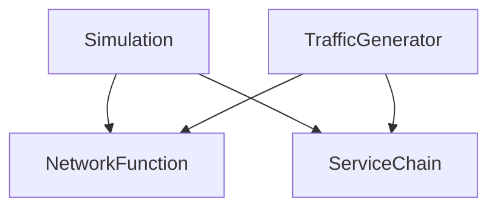

During the meeting on [[22-04]], the following image was drawn up:
![[Pasted image 20240424143653.png]]elaborating on the context in which VNFnet will be placed

The most important conclusions are:
1. The environment class need not be elaborate, as it will be Anestis who will add functionality here later -> for now just focus on the basics and the connection with the AI stuff
2. Traffic generation will be done in a separate class; something called 'Traffic'. This class will read the state of the VNFnet simulation and generate Service Requests. Because these classes will likely share some definitions, the dependency graph could look like this:

3. Devices; each host could have a list of available devices that VMs can use. NB: only one VM can use an attached device at a time.